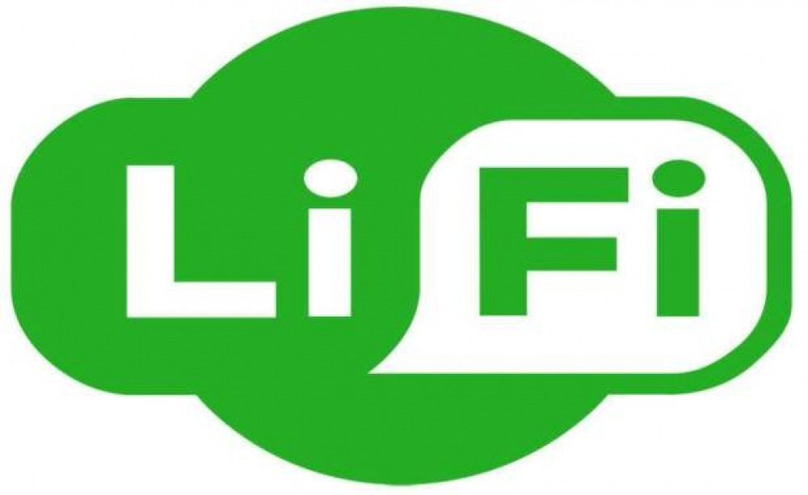

# LIFI(LIGHT FIDELITY)

## PENGERTIAN LIFI

Li-Fi merupakan singkatan dari Light Fidelity, yakni sebuah teknologi hasil dari percobaan yang dilakukan oleh University College dan Oxford University. Teknologi jaringan nirkabel ini menggunakan cahaya sebagai media pengantar data dengan kecepatan hingga 100 Gbps. Kecepatan tersebut berkali-kali lipat lebih tinggi dibandingkan dengan Wi-Fi yang hanya menggunakan frekuensi radio konvensional dengan kecepatan tertinggi 135,7 Mbps.

### SEJARAH LIFI

Istilah Li-Fi pertama kali dicetuskan oleh profesor Harald Haas, seorang pakar fisika asal Jerman. Harald Haas menciptakan lampu sebagai router nirkabel pada tahun 2001.Setahun kemudian, Harald mendirikan perusahaan riset teknologi Li-Fi bernama pureLiFi dengan sejumlah grup yang telah melakukan riset tentang Li-Fi semenjak tahun 2008.
LiFi menggunakan bohlam LED (Light Emitting Diodes) komersil pada umumnya untuk media transfer data. Diketahui LiFi mempunyai kecepatan transfer data 100 kali lebih cepat daripada WiFi. Dengan asumsi bahwa kecepatan WiFi rata rata 10 Mbps, maka kecepatan LiFi bisa mencapai 100 Gbps.

### CARA KERJA LIFI

Cara kerja teknologi ini adalah menggunakan sumber cahaya yang cukup seperti LED (Light Emitting Diodes) ataupun Light Sensor, kemudian ujung perangkat lain akan melakukan deteksi serta mengartikannya sebagai biner yang sama kemudian akan dapat dibaca oleh komputer.Artinya, teknologi ini dapat bekerja apabila masing-masing perangkat yang dimiliki dapat terhubung dan saling berpasangan untuk melakukan kegiatan seperti menstransmisikan data.
Contoh sederhana kerja Light Fidelity yang dapat kita rasakan saat ini adalah cahaya yang terdapat pada remote TV (cahaya infra-merah) yang mampu melakukan transmisi data lebih dari 1000 bps.Sedangkan lampu LED (Light Emitting Diodes) yang digunakan saat ini telah mengalami perkembangan dengan kemampuan transmisi data yang stabil dan terlihat seperti cahaya lampu pada umumnya.

### Penyebab Tingginya Kecepatan Li-Fi

Kalian pasti penasaran mengapa Li-Fi bisa sangat cepat. Alasannya adalah karena LED yang merupakan semikonduktor memiliki sifat berbeda dari jenis lampu lainnya. LED mampu untuk berganti nyala dan mati hanya dalam waktu beberapa nanodetik atau miliar detik. Bila dikonversikan dalam kecepatan data, nanodetik itu setara dengan 1 Gbits/s yang artinya lebih cepat 10 kali lipat dari Wi-Fi yang hanya bisa mencapai kecepatan data 100 Mbits/s.

### KELEBIHAN

- Dari segi kecepatan transfer data, LiFi jelas lebih cepat dibandingkan teknologi yang ada sekarang, seperti WiFi. Sebagai perbandingan, sampai sekarang, kecepatan tertinggi yang bisa ditangkap WiFi mencapai 7 GBps. Sedangkan LiFi, karena mengandalkan kecepatan cahaya, LiFi mampu mencatatkan kecepatan transfer mencapai 100 GBps!
- Untuk menggunakannya, kita nggak perlu banyak piranti atau kabel tambahan. Yang kita butuhkan hanyalah LED sebagai sarana untuk transfer datanya.
- Karena nggak menggunakan kabel dan nggak berada dalam jangkauan gelombang radio, teknologi ini diyakini mampu mengurangi polusi elektromagnetik yang dihasilkan oleh WiFi.
- Teknologi ini nggak bisa menembus dinding, itu sebabnya, LiFi aman dari serangan peretas.
- Teknologi ini juga bisa diapliasikan di daerah-daerah terpencil yang belum terjangkau oleh kabel optik.

### KEKURANGAN

- Meski 'base station', atau bisa ditempel di langit-langit ruangan, teknologi ini tetap membutuhkan direct line of sight atau pandangan langsung ke gadget tujuan.
- Berbeda dengan gelombang radio, cahaya yang digunakan LiFi nggak bisa menembus tembok. So, untuk menikmatinya, kita hanya bisa berselancar di dunia maya selama masih berada di satu ruangan dengan teknologi ini. 

### REFERENSI

https://www.baktikominfo.id/id/informasi/pengetahuan/mengenal_li-fi_teknologi_pengganti_wi-fi_di_masa_depan-708
https://tekno.foresteract.com/lifi/#:~:text=Cara%20kerja%20teknologi%20ini%20adalah,akan%20dapat%20dibaca%20oleh%20komputer.
https://lancangkuning.com/post/10669/apa-itu-lifi-dan-apa-perbedaanya-dengan-wifi.html
https://hmte.ft.uns.ac.id/category/teknologi/

